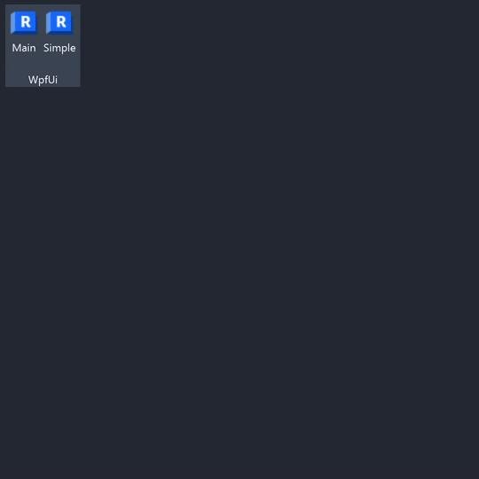

# RevitAddin.WpfUi.Sample

[](../..)
[](../..)
[](https://nuke.build/)
[](LICENSE)
[](../../actions)

This project was generated by the [ricaun.AppLoader](https://ricaun.com/AppLoader/) Revit plugin.

## Wpf.Ui

This project use an alternative version of the [Wpf.Ui](https://github.com/lepoco/wpfui) version `3.0.4` design with the feature `ApplicationThemeManager.Apply(this);` to apply the theme in the main `Window`.



The package [Revit.Wpf.Ui](https://github.com/ricaun/wpfui/releases/tag/3.0.4-revit-release) is a fork of the original package with some changes to work with Revit 2025.

The main change is the PR [Update UiApplication.cs](https://github.com/lepoco/wpfui/pull/1082) to fix Revit 2025 incompatibility, the package id changed to `REVIT-WPF-UI` and the assembly is `Revit.Wpf.Ui.3.0.4` to avoid conflicts with the original package.

The folder [References](References) contains the `REVIT-WPF-UI.3.0.4.nupkg` package with the `nuget.config` file to use the local package.

### Usage

Apply the theme in the main `Window` or `Page` using the `ApplicationThemeManager.Apply(this);` method.

```C#
public partial class MainWindow
{
    public MainWindow()
    {
        InitializeComponent();
        ApplicationThemeManager.Apply(this);
    }
}
```

Use `ui:FluentWindow` to enable the Fluent Design in the `Window`.

```xaml
<ui:FluentWindow
  ...
  xmlns:ui="http://schemas.lepo.co/wpfui/2022/xaml"
  ExtendsContentIntoTitleBar="True"
  WindowBackdropType="Auto"
  >
  <StackPanel>
      <ui:TitleBar Title="WPF UI"/>
      <ui:Card Margin="8">
          <ui:Button Content="Hello World" Icon="{ui:SymbolIcon Fluent24}" />
      </ui:Card>
  </StackPanel>
</ui:FluentWindow>
```

Using `Page` to apply the background and foreground.
```xaml
<Page
    ...
    Background="{DynamicResource ApplicationBackgroundBrush}"
    Foreground="{DynamicResource TextFillColorPrimaryBrush}"
    >
</Page>
```

## Video

Video in English about this project.

[![VideoIma1]][Video1] [![VideoIma2]][Video2]

## Installation

* Download and install [RevitAddin.WpfUi.Sample.exe](../../releases/latest/download/RevitAddin.WpfUi.Sample.zip)

## License

This project is [licensed](LICENSE) under the [MIT License](https://en.wikipedia.org/wiki/MIT_License).

---

Do you like this project? Please [star this project on GitHub](../../stargazers)!

[Video1]: https://youtu.be/Ymwm8QMb6Ow
[VideoIma1]: https://img.youtube.com/vi/Ymwm8QMb6Ow/mqdefault.jpg
[Video2]: https://youtu.be/s9KEa0_GUlw
[VideoIma2]: https://img.youtube.com/vi/s9KEa0_GUlw/mqdefault.jpg